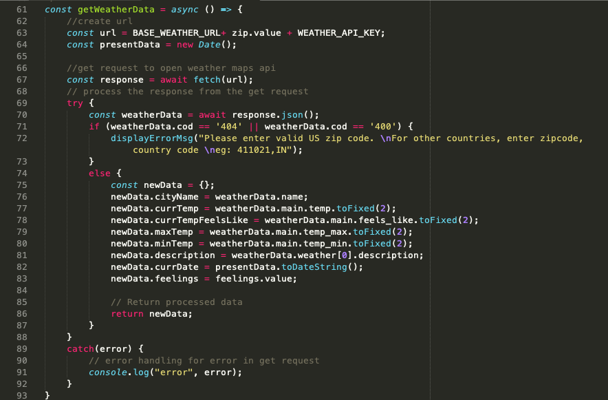
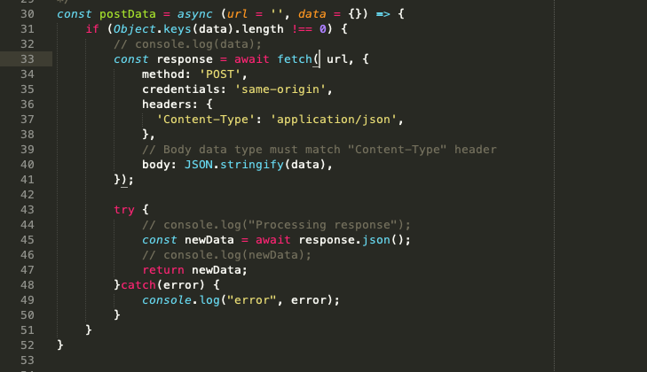
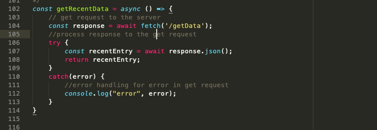
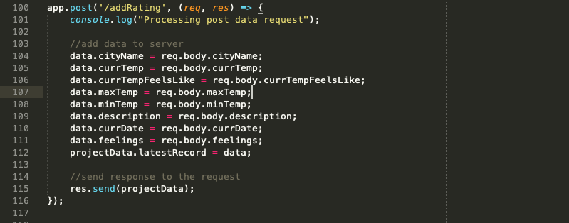
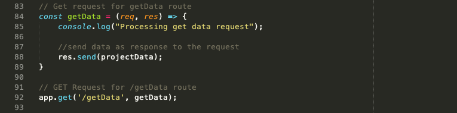
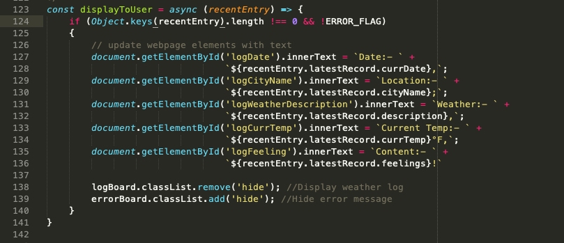

# Weather Journal App Project

## Description
The aim of the project was to create an asynchronous web app that uses Web API and user data to dynamically update the UI for a Weather-Journal App.
**Languages used**
- JS
- CSS
- HTML

## Project Requirements
- **Node & Express Environment**
	Require express and create an app instance using it.
	Use node to the server file
- **API**
	Use Open Weather Maps api to get weather data using personal API creadentials.
- **Routes**
	GET route to get data from Open Weather Maps API.
	GET route on client side to get data from server.
	GET route on server side, that is a callback function to return JS object
	POST request on the client side to send data to the given url on the server
	POST route on server side, to post data obtained from external API on the server
- **Dynamic UI**
	Dynamically update UI using the data recived from the server.

## Demo
Please see Usage Section

## Code Examples
server.js is the JS server files which forms the back-end of the weather journal app.
app.js in the website/js folder contains the js script for the client side.
Below listed are few of the important coding sections in these files that ensure delivery of
the project requirement and functional flow of the project.

- **Get request to get data from Open Weather Maps API**
Asynchronus function ```getWeatherData``` in app.js uses the API credentials and zip code provided by the user to get data from Open Weather Maps API. This data is then needs to be stored on the server


- **Post request for data received from API and user to the server**
Asynchronus function ```postData``` in app.js uses the post route(url) and the data to be posted to make a post request to the server to store the data on the server side.


- **Get request to get data from the server**
Asynchronus function ```getRecentData``` in app.js uses the get route(url) to make a get request to the server. When it receives data from the server it processes it further.


- **Post route to load data on the server**
For route ```/addRating```, server.js executes the post request to load data to the app instance on the server.


- **Get route to send data to client side**
Function ```getData``` for route ```/getData``` in server.js executes the get request to return data to the client.


- **Dynamically Update UI**
Asynchronus function ```displayToUser``` in app.js updates the UI dynamicall


- **Create background animation**
CSS file animation.css in website/css folder creates the background bubble animation

## Usage
1. Clone or download this repo
2. Check if node is installed on your system
	- If not download and install node
3. Ensure that packages ```dependencies``` in package.json are avaialable in your folder
4. Create you API key on Open Weather Maps
5. Replace the current API key in `WEATHER_API_KEY` in app.js with your API key from step 4.
6. Run this code using `node server.js` from the terminal
7. Access the webpage using address `http://localhost:3000/`

## Good to have features for future enhancements
- Create option to choose if displayed temperature is in °F or °C.
- Display country for the city in weather log
- Display other weather details like wind speed, min & max temp for the day.
- Display a map and pin point to the location in weather log